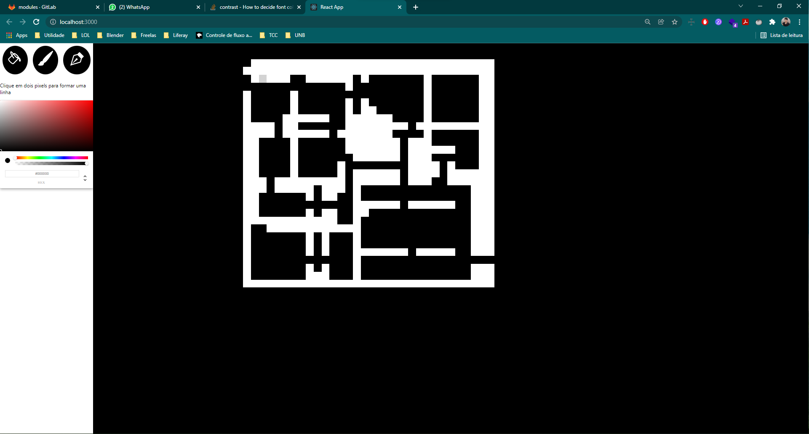
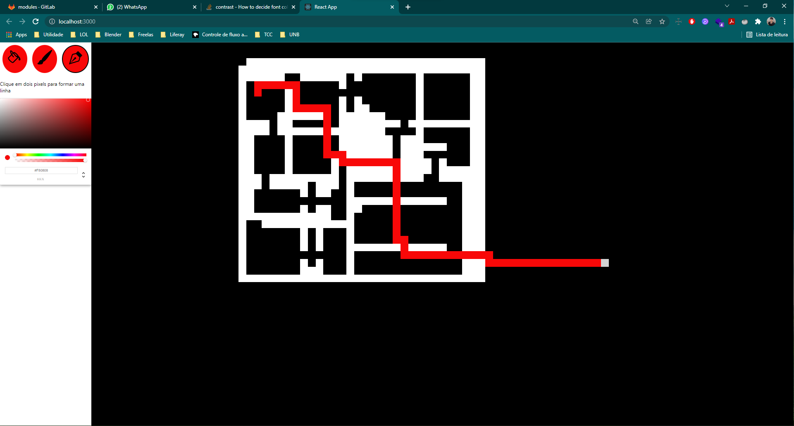
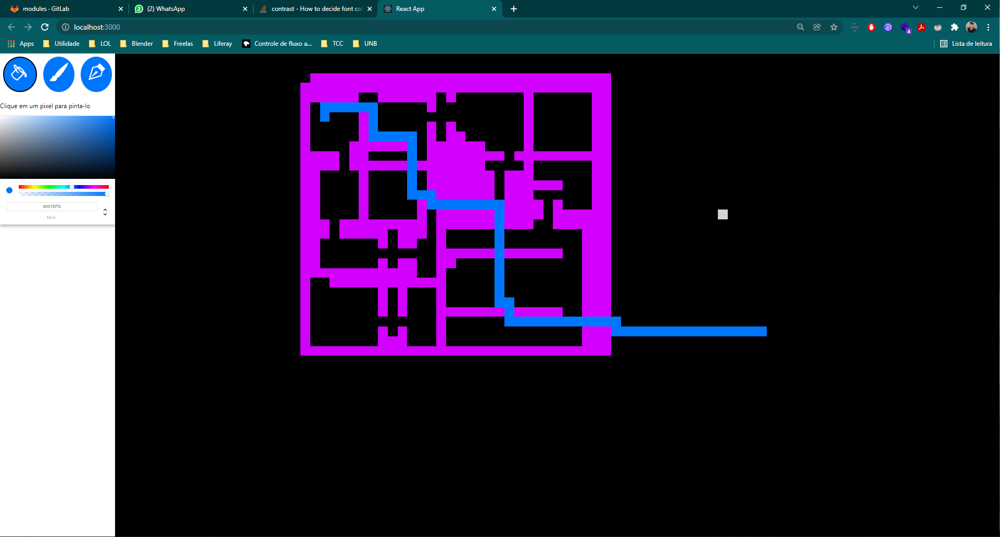

## Sobre 
O objetivo do projeto é implementar um minipaint apenas com a ferramenta de "balde", "vetor" e "lapis" para obter:
1. A implementação da ferramenta balde utilizando flood fill
2. A demonstração do caminho mais curto entre dois pontos de um grafo e um resolvedor de labirinto utilizando a ferramenta vetor
* A ferramenta de vetor tenta sempre traçar o caminho mais curto passando apenas pela cor do ultimo ponto selecionado, se não for possível, ela traça o caminho mais curto.
## Screenshots
Adicione 3 ou mais screenshots do projeto em funcionamento.

## Instalação 
**Linguagem**: Javascript 
**Framework**: React 

Pré-requisitos: Node v17.4.0

### Instalação:
* Execute o comando `npm install -g yarn`
* Vá até o diretorio do projeto e digite `yarn install`
* Após a conclusão da instalação, execute o comando `npm start`

